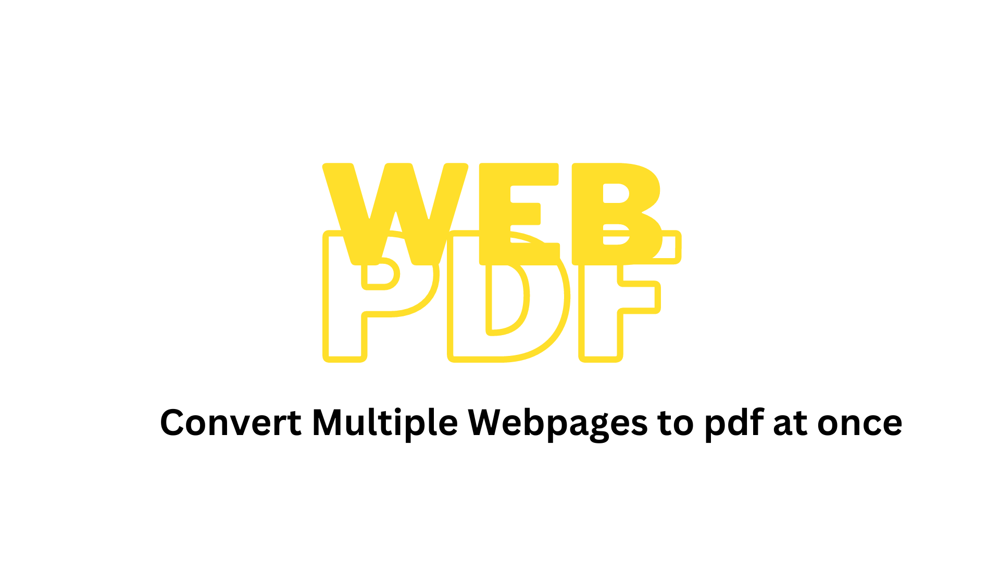

# WebPdf

<!--  -->

This is a chrome extension that helps in converting multiple set of webpages into a single pdf file.

<https://user-images.githubusercontent.com/66634814/212395808-79ffad1e-8cc0-4853-b3a0-e6fd4af88623.MP4>

> Built with 💗 & ⚡ by [Codad5](https://github.com/codad5)
